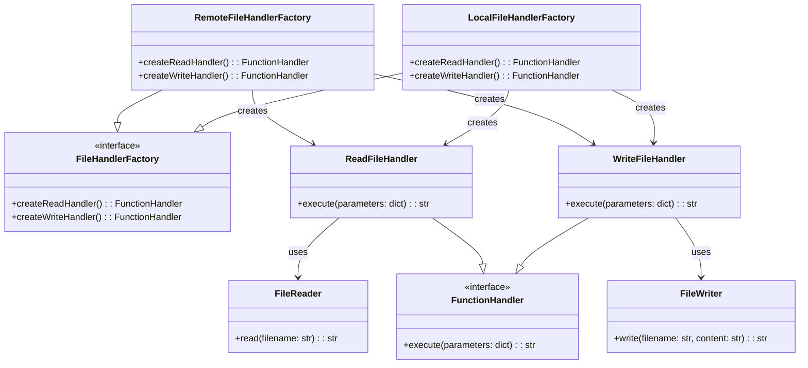

Act as an expert Python Developer and seasoned user of the Gang of Four Design pattern principals.

The folling code builds a prompt.md file that adds files as I select them.  The script works fine, I just want you to add to it.

After I select "done", I need the script to read the mermaid_class.md file and print its contents at the end of prompt.md file like this:
===== START OF TEXT TO BE ADDED =====
# Mermaid class diagram for the project

===== END TEXT TO BE ADDED AT THE END OF THE FILE =====

Here is the file that I need altered:
```python
import os

def initialize_prompt_file():
    with open('prompt.md', 'w') as f:
        f.write("# Who you are\n")
        f.write("You are an expert Python Developer and seasoned user of the Gang of Four Design Pattern Principals.\n\n")
        f.write("# Relevant Source Code\n")

def find_python_files(root_dir):
    python_files = []
    for root, dirs, files in os.walk(root_dir):
        if 'tests' in dirs:
            dirs.remove('tests')  # exclude 'tests' directory
        for file in files:
            if file.endswith('.py') and file != '__init__.py':
                path = os.path.join(root, file)
                relative_path = os.path.relpath(path, root_dir).replace(os.sep, '.')
                python_files.append(relative_path[:-3])  # remove .py extension
    return python_files

def select_files_menu(python_files, selected_files):
    print("\nSelect a file to include in the prompt (type number and press Enter, type 'done' to finish):")
    for i, file in enumerate(python_files, 1):
        selection_mark = "SELECTED" if i in selected_files else ""
        print(f"{i}. {file.ljust(50)} {selection_mark}")

def append_to_prompt(file_path, root_dir):
    full_path = os.path.join(root_dir, file_path.replace('.', os.sep) + '.py')
    try:
        with open(full_path, 'r') as file:
            content = file.read()

        # Find the start of the class definition and extract from there
        class_start_index = content.find("class ")
        if class_start_index != -1:
            content = content[class_start_index:]

        class_name = file_path.split('.')[-1]
        with open('prompt.md', 'a') as f:
            f.write(f"## {class_name} class\n")
            f.write("```python\n")
            f.write(content)
            f.write("\n```\n")
    except IOError:
        print(f"Failed to read file: {full_path}")
    except Exception as e:
        print(f"An error occurred: {e}")


def main():
    root_dir = input("Enter the root directory of your project: ")
    initialize_prompt_file()
    python_files = find_python_files(root_dir)
    selected_files = set()

    while True:
        # os.system('clear' if os.name == 'posix' else 'cls')  # clear console
        select_files_menu(python_files, selected_files)
        choice = input()
        if choice.lower() == 'done':
            break
        if choice.isdigit() and 1 <= int(choice) <= len(python_files):
            file_index = int(choice)
            if file_index not in selected_files:  # only append if not already selected
                append_to_prompt(python_files[file_index - 1], root_dir)
                selected_files.add(file_index)

if __name__ == "__main__":
    main()
```

Please write the neccessary code to do this.

