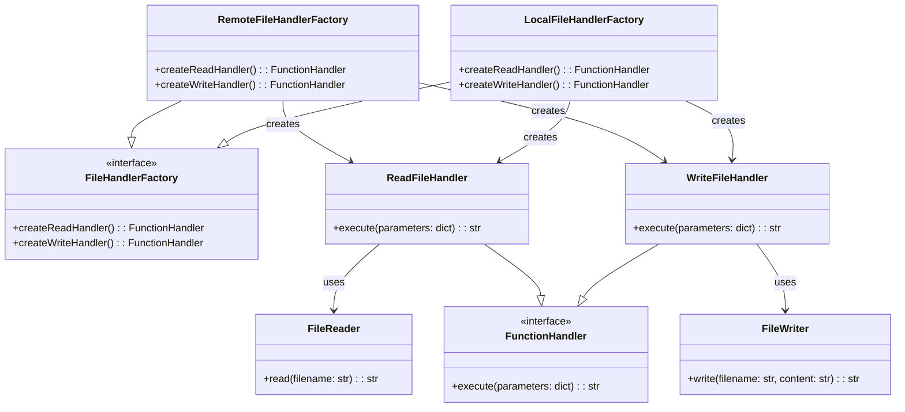

# Mermaid class diagram

```mermaid
classDiagram
    class FileHandlerFactory {
        <<interface>>
        +createReadHandler(): FunctionHandler
        +createWriteHandler(): FunctionHandler
    }
    class LocalFileHandlerFactory {
        +createReadHandler(): FunctionHandler
        +createWriteHandler(): FunctionHandler
    }
    class RemoteFileHandlerFactory {
        +createReadHandler(): FunctionHandler
        +createWriteHandler(): FunctionHandler
    }
    class FunctionHandler {
        <<interface>>
        +execute(parameters: dict): str
    }
    class ReadFileHandler {
        +execute(parameters: dict): str
    }
    class WriteFileHandler {
        +execute(parameters: dict): str
    }
    class FileReader {
        +read(filename: str): str
    }
    class FileWriter {
        +write(filename: str, content: str): str
    }
    LocalFileHandlerFactory --|> FileHandlerFactory
    RemoteFileHandlerFactory --|> FileHandlerFactory
    ReadFileHandler --> FileReader : uses
    WriteFileHandler --> FileWriter : uses
    WriteFileHandler --|> FunctionHandler
    ReadFileHandler --|> FunctionHandler
    LocalFileHandlerFactory --> ReadFileHandler : creates
    LocalFileHandlerFactory --> WriteFileHandler : creates
    RemoteFileHandlerFactory --> ReadFileHandler : creates
    RemoteFileHandlerFactory --> WriteFileHandler : creates
```
